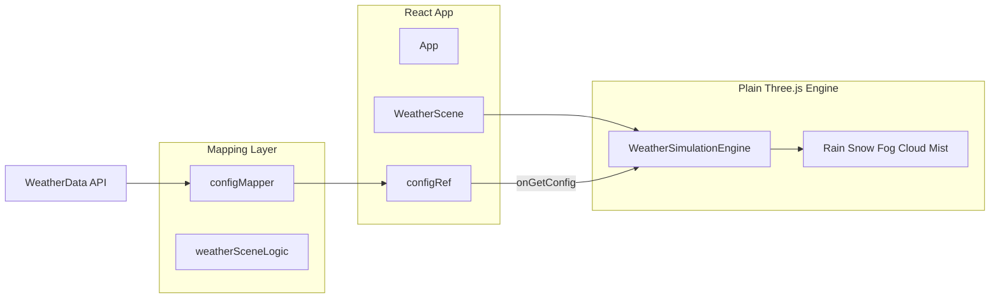
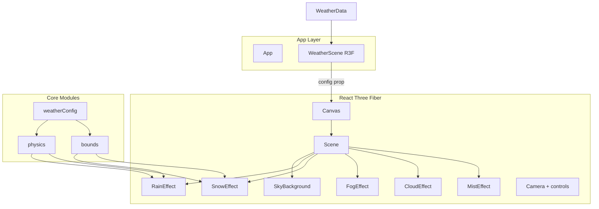

# React Three Fiber Weather Engine Migration Plan

## 1. Current State Analysis

### 1.1 Architecture and Data Flow



- **WeatherScene** (`[WeatherScene.tsx](src/components/weather-scene/WeatherScene.tsx)`): mounts engine in `useEffect`, passes `onGetConfig: () => configRef.current`. Config is written to ref every render and pulled by the engine each frame.
- **Config source**: `[configMapper.ts](src/weather-simulation/physics/configMapper.ts)` maps `WeatherData` + `DebugOverrides` to `SimulationConfig`. Uses `[weatherSceneLogic.ts](src/components/weather-scene/weatherSceneLogic.ts)` for `weather_code` → effect type/intensity and cloud cover.
- **Engine** (`[WeatherSimulationEngine.ts](src/weather-simulation/WeatherSimulationEngine.ts)`): owns scene, camera, renderer, `requestAnimationFrame` loop; creates five effect classes; each frame calls `onGetConfig()`, computes bounds, updates all effects, renders.

### 1.2 Weather Data and Engine Inputs

| Data (WeatherData / API) | Used by engine? | Notes                                                     |
| ------------------------ | --------------- | --------------------------------------------------------- |
| weather_code             | Yes             | Drives effect type, intensity, cloud cover, fog           |
| wind speed (speed)       | Yes             | Rain/snow/cloud/mist drift                                |
| wind_direction           | Yes             | Wind vector                                               |
| dt, sunrise, sunset      | Yes             | Time of day phase                                         |
| **temperature (temp)**   | **No**          | Not passed; could drive snow vs rain blend, fog intensity |
| **humidity**             | **No**          | Could influence fog/mist                                  |
| **visibility**           | **No**          | API has it; could scale fog density                       |
| **precipitation**        | **No**          | Could refine intensity                                    |

So the engine does **not** currently correlate with temperature or humidity; only wind and weather_code are used.

### 1.3 Weather Code Coverage (Open-Meteo WMO) — Full Handling

The engine must handle **all** WMO/Open-Meteo weather codes (0–99). Current `[getEffectTypeAndIntensity](src/components/weather-scene/weatherSceneLogic.ts)` covers only a subset; gaps and desired behaviour are below.

**Complete code → effect mapping (implement in `weather/codes.ts` during migration):**

| Code range | Description (WMO/Open-Meteo)           | Effect type          | Intensity      | Notes                                                                                                                                                       |
| ---------- | -------------------------------------- | -------------------- | -------------- | ----------------------------------------------------------------------------------------------------------------------------------------------------------- |
| 0          | Clear sky                              | clear                | light          | No precipitation; cloudCover 0. Intensity = sky state (see 1.7).                                                                                            |
| 1          | Mainly clear                           | clear                | light          | Slight clouds; cloudCover 0.2.                                                                                                                              |
| 2          | Partly cloudy                          | clear                | **moderate**   | **Clear with intensity = moderate** drives cloud amount (cloudCover 0.55).                                                                                  |
| 3          | Overcast                               | clear                | **heavy**      | **Clear with intensity = heavy** = overcast sky (cloudCover 0.95).                                                                                          |
| 4–9        | (Obscuration / haze / development)     | clear or fog         | light          | Map 4–5 to fog/mist if “haze”; else clear. Open-Meteo may not return these.                                                                                 |
| 10–19      | Mist, diamond dust, lightning, squalls | fog / mist or clear  | light–moderate | 10 = mist → fog or mist; 11 = diamond dust → snow (light); 12/18/19 → clear or thunderstorm light.                                                          |
| 20–29      | Past weather / blowing snow            | fog or snow          | light–heavy    | 20 = fog (past) → fog moderate; 21–26 map to rain/snow/fog by type; 27–29 = blowing snow/sand → **snow** (wind already in config), intensity by visibility. |
| 30–35      | Fog variants                           | fog                  | light–moderate | 30–35 = fog / ice fog / thickening / rime → fog; intensity from code.                                                                                       |
| 36–39      | Blowing snow / sand / dust             | snow or **dust**     | moderate–heavy | **Gap.** Map to **snow** with high wind (effect = snow; wind already strong). Optionally add “dust” effect later.                                           |
| 40         | Fog at distance                        | fog                  | light          | **Gap.** Fog, light intensity.                                                                                                                              |
| 41–44      | (Precipitation / fog)                  | fog or rain          | light          | If used by API, map to fog or rain.                                                                                                                         |
| 45         | Fog                                    | fog                  | moderate       |                                                                                                                                                             |
| 46–47      | (Fog / drizzle)                        | fog or rain          | light          |                                                                                                                                                             |
| 48         | Depositing rime fog                    | fog                  | moderate       |                                                                                                                                                             |
| 49–50      | (Reserved / drizzle)                   | fog or rain          | light          |                                                                                                                                                             |
| 51         | Light drizzle                          | rain                 | light          |                                                                                                                                                             |
| 52         | (Moderate drizzle – often 53)          | rain                 | moderate       |                                                                                                                                                             |
| 53         | Moderate drizzle                       | rain                 | moderate       |                                                                                                                                                             |
| 54         | (Dense drizzle – often 55)             | rain                 | heavy          |                                                                                                                                                             |
| 55         | Dense drizzle                          | rain                 | heavy          |                                                                                                                                                             |
| 56         | Light freezing drizzle                 | rain                 | light          | Consider temperature: near 0°C → rain/snow blend later.                                                                                                     |
| 57         | Dense freezing drizzle                 | rain                 | heavy          | Same as above.                                                                                                                                              |
| 58–60      | (Reserved / rain)                      | rain                 | light          | Fallback rain light.                                                                                                                                        |
| 61         | Slight rain                            | rain                 | light          |                                                                                                                                                             |
| 62         | (Moderate rain – often 63)             | rain                 | moderate       |                                                                                                                                                             |
| 63         | Moderate rain                          | rain                 | moderate       |                                                                                                                                                             |
| 64         | (Heavy rain – often 65)                | rain                 | heavy          |                                                                                                                                                             |
| 65         | Heavy rain                             | rain                 | heavy          |                                                                                                                                                             |
| 66         | Light freezing rain                    | rain                 | light          | **Gap** in intensity handling; treat as rain. Temp can later drive ice look.                                                                                |
| 67         | Heavy freezing rain                    | rain                 | heavy          | Same.                                                                                                                                                       |
| 68–69      | (Freezing rain / mix)                  | rain                 | moderate–heavy | **Gap.** Map to rain; intensity moderate (68) or heavy (69).                                                                                                |
| 70–79      | Snow / grains                          | snow                 | light–heavy    | 71–73 = slight–moderate snow; 75 = heavy; 77 = snow grains → snow moderate. 74, 76, 78–79 if present → snow.                                                |
| 80         | Slight rain showers                    | rain                 | light          |                                                                                                                                                             |
| 81         | Moderate rain showers                  | rain                 | moderate       |                                                                                                                                                             |
| 82         | Violent rain showers                   | rain                 | heavy          |                                                                                                                                                             |
| 83–84      | (Mixed showers)                        | rain or snow         | moderate       | Rain or snow by temp if available; else rain.                                                                                                               |
| 85         | Slight snow showers                    | snow                 | light          |                                                                                                                                                             |
| 86         | Heavy snow showers                     | snow                 | heavy          |                                                                                                                                                             |
| 87–94      | (Hail / snow/rain mix)                 | rain or thunderstorm | moderate–heavy | 87–88 = slight/heavy snow pellets; 89–90 = hail; 91–94 = thunder with precip → **thunderstorm** or rain.                                                    |
| 95         | Thunderstorm                           | thunderstorm         | light          |                                                                                                                                                             |
| 96         | Thunderstorm + slight hail             | thunderstorm         | moderate       |                                                                                                                                                             |
| 97–98      | Thunderstorm + heavy hail / squalls    | thunderstorm         | heavy          | **Gap.** Map 97–98 to thunderstorm heavy.                                                                                                                   |
| 99         | Thunderstorm + heavy hail              | thunderstorm         | heavy          |                                                                                                                                                             |

**Implementation requirements:**

1. **Single function** `getEffectTypeAndIntensity(code: number): { type: EffectType; intensity: Intensity }` in `weather/codes.ts` that returns a value for **every** integer 0–99. Use a lookup table or range checks; default unknown codes to `{ type: 'clear', intensity: 'light' }`.
2. **Cloud cover**: `getCloudCoverFromWeatherCode(code: number): number` must handle all codes that imply clouds (0–3, 45–48, 80–99, etc.) as in current logic; extend for any new codes (e.g. 4–5 haze → 0.3, 36–39 → 0.8).
3. **Mist**: No separate WMO code; keep “mist” as a visual layer when `fogDensity > 0` (fog + mist planes). Optionally in Phase 4, codes 4–5 or 10 (mist) could set a `mistAmount` in config.
4. **Temperature correlation**: For 56–57, 66–67, 68–69, 83–84, use `temperature` in config (Phase 4) to optionally blend rain/snow or choose effect (e.g. below 0°C → snow, above → rain for freezing drizzle).
5. **Tests**: Add unit tests that assert `getEffectTypeAndIntensity(code)` for at least one code in each range above (and for codes 0, 1, 2, 3, 45, 48, 51, 61, 66, 71, 80, 85, 95, 99) and that no code 0–99 throws or returns undefined. Assert **clear intensity**: 0→light, 1→light, 2→moderate, 3→heavy.

### 1.7 Clear Weather and Intensity (Design Rule)

**Problem**: Today, clear weather (codes 0–3) always returns `intensity: 'light'`. The scene cannot express “partly cloudy” or “overcast” as a variation of non-precipitation; cloud cover is derived only from `getCloudCoverFromWeatherCode`, and config.intensity is meaningless for clear.

**Rule**: **Every effect type, including clear, must have a meaningful intensity.**

- **Clear**: Intensity = sky state.
  - `light` = clear or mainly clear (codes 0, 1) → few or no clouds.
  - `moderate` = partly cloudy (code 2) → moderate cloud cover.
  - `heavy` = overcast (code 3) → full cloud cover.
- **Implementation**:
  - `getEffectTypeAndIntensity`: 0 → clear/light, 1 → clear/light, 2 → clear/**moderate**, 3 → clear/**heavy**.
  - `getCloudCoverFromWeatherCode` stays as is for 0–3 (0, 0.2, 0.55, 0.95). Config has both `cloudCover` and `intensity`; when effectType is clear, they are consistent (intensity drives the same idea as cloud cover).
  - **SkyBackground / CloudEffect**: When `effectType === 'clear'`, use `config.intensity` (or `config.cloudCover`) to drive cloud opacity and amount. So “Clear + Heavy” (e.g. from debug overrides) shows an overcast sky.
  - **Debug overrides**: Allow setting intensity when effect type is clear (e.g. “Clear” + “Heavy” = overcast). In config mapper, when overrides set effectType to clear and intensity to a value, set `cloudCover` from that intensity (e.g. light→0.2, moderate→0.55, heavy→0.95) so the scene reflects the override.
- **Consistency**: For other types (fog, rain, snow, thunderstorm), intensity already has a meaning (density, particle count, strength). Clear is the only type that previously ignored intensity; after this change, no effect type has a “neutral” or unused intensity.

### 1.4 Bugs and Issues

- **Fixed deltaTime**: Engine passes `1/60` to all effect `update(dt, ...)`. Should use actual frame delta for consistent behavior across frame rates (`[WeatherSimulationEngine.ts](src/weather-simulation/WeatherSimulationEngine.ts)` ~219–223).
- **FogEffect allocates every frame**: `this.scene.fog = new THREE.FogExp2(...)` when density > 0. Recreates object every frame; should reuse and only set `density`/`color` (`[FogEffect.ts](src/weather-simulation/effects/FogEffect.ts)`).
- **Frustum bounds not camera-derived**: `[cameraFrustum.ts](src/weather-simulation/cameraFrustum.ts)` computes `visibleX`, `visibleY` from camera but then uses hardcoded `spawnXMin/Max`, etc. Bounds are not actually derived from frustum; either use computed values or remove dead code.
- **Cloud recycle order**: In `[CloudEffect.ts](src/weather-simulation/effects/CloudEffect.ts)` update, multiple `if / else if` checks can leave a cloud in a bad state if it crosses two boundaries; doc plan mentioned single teleport per frame – ensure only one branch runs per cloud (e.g. priority order and early continue).

### 1.5 Redundancy and Bad Practices

- **Two physics files**: `[components/weather-scene/weatherPhysics.ts](src/components/weather-scene/weatherPhysics.ts)` (defines `FOG_DENSITY`, different `SNOW_FALL_SPEED`, `WeatherIntensity`) and `[weather-simulation/physics/weatherPhysics.ts](src/weather-simulation/physics/weatherPhysics.ts)` (used by effects; has `MIST_WIND_FACTOR` but MistEffect uses `CLOUD_WIND_FACTOR`). Single source of truth for physics constants in simulation layer; remove or deprecate component-scene physics.
- **Duplicate types**: `WeatherEffectType` / `WeatherIntensity` in weatherSceneLogic vs `EffectType` / `Intensity` in `[weather-simulation/types.ts](src/weather-simulation/types.ts)`. Unify in one place (e.g. simulation or shared types).
- **Config ref pattern**: Pushing config via ref + callback is imperative and easy to get out of sync; R3F allows config as props and reactive updates.
- **Engine imports from component**: `[WeatherSimulationEngine](src/weather-simulation/WeatherSimulationEngine.ts)` imports `getTimeOfDayPhase` from `../components/weather-scene/weatherSceneLogic`. Simulation should not depend on UI components; move time-of-day (and any shared mapping) into simulation or shared lib.

### 1.6 Effect Modules Summary

| Effect | Init                                           | Update                           | Dispose               | Dependencies              |
| ------ | ---------------------------------------------- | -------------------------------- | --------------------- | ------------------------- |
| Rain   | Points geom + material, spawn from getSpawnX/Z | Wind + fall, recycle by bounds   | Dispose geom/material | configMapper bounds, RAIN |
| Snow   | Points + phase attr, spawn range               | Wind + fall + sway, recycle      | Dispose               | SNOW, bounds              |
| Fog    | Store scene ref                                | applyFog (new FogExp2 each time) | scene.fog = null      | fogDensity                |
| Cloud  | Group of meshes, random spawn                  | Wind, recycle by X/Z, opacity    | Dispose children      | cloudCover, CLOUD         |
| Mist   | Group of planes                                | Wind, recycle, opacity           | Dispose               | fogDensity, CLOUD         |

---

## 2. Target Architecture (R3F, Modular)

### 2.1 High-Level Structure



- **Single entry**: One R3F `<Canvas>` inside `WeatherScene`; config passed as prop (or from context).
- **Effects as components**: Each effect is a React component that uses `useFrame` and refs to Three objects; visibility and parameters from config (no imperative init/update/dispose).
- **Core modules**: Shared `weatherConfig` (WeatherData → simulation config, all weather types + wind/temp/humidity), `physics` constants, `bounds` (frustum or fixed).

### 2.2 Proposed Folder Structure (Modular)

```
src/
├── weather/                          # Weather domain (shared)
│   ├── types.ts                      # WeatherData, Units, etc. (existing types/weather can re-export)
│   ├── codes.ts                     # Full WMO 0–99 mapping: getEffectTypeAndIntensity, getCloudCoverFromWeatherCode (see 1.3)
│   └── config.ts                    # WeatherData + overrides → SimulationConfig (unified mapper)
├── weather-scene/                    # R3F scene (rename or keep)
│   ├── WeatherScene.tsx             # R3F Canvas, config from props/context
│   ├── scene/
│   │   ├── SkyBackground.tsx        # Day/night/storm gradients + solid
│   │   ├── CameraRig.tsx            # Parallax + optional shake
│   │   └── FlashOverlay.tsx         # Thunderstorm flash (or keep DOM)
│   ├── effects/
│   │   ├── RainEffect.tsx
│   │   ├── SnowEffect.tsx
│   │   ├── FogEffect.tsx
│   │   ├── CloudEffect.tsx
│   │   └── MistEffect.tsx
│   ├── physics/
│   │   └── constants.ts             # All RAIN_*, SNOW_*, CLOUD_*, MIST_*, WIND_*, etc.
│   ├── bounds/
│   │   └── frustumBounds.ts          # computeFrustumBounds, getSpawnX/Z (from camera or fixed)
│   └── types.ts                     # SimulationConfig, EffectType, Intensity, FrustumBounds, DebugOverrides
├── components/weather-scene/         # Legacy wrapper only if needed
│   └── (optional) thin wrapper that imports from weather-scene
```

- **weather**: Domain types and mapping; no Three.js. `config.ts` is the single place that maps WeatherData (+ overrides) → SimulationConfig, using `codes.ts` and optional temperature/humidity/visibility.
- **weather-scene**: R3F-only. Scene, sky, camera, effects; uses `weather/config`, `weather-scene/physics`, `weather-scene/bounds`.

### 2.3 SimulationConfig Enhancement (All Weather Types + Correlation)

- **Unify and extend** `[SimulationConfig](src/weather-simulation/types.ts)` so one config drives all effects and supports future correlation:
  - Keep: effectType, intensity, particleCount, fogDensity, cloudCover, thunderstorm, windSpeed, windDirection, timeOfDay, sunrise, sunset, useRealtimeClock, parallaxAmount.
  - **Intensity is always meaningful**: For clear, intensity = sky state (light/moderate/heavy = clear → overcast); for fog/rain/snow/thunderstorm it already drives density/particles/strength. Overrides must be able to set intensity for any effect type, including clear (see 1.7).
  - Add (optional for first phase): `temperature?: number`, `humidity?: number`, `visibility?: number`. Use in config mapper from WeatherData; effects can later use (e.g. fog density scaled by humidity, snow/rain blend by temp).
- **Weather codes**: Implement **full 0–99 handling** in `weather/codes.ts` as specified in **section 1.3**: single `getEffectTypeAndIntensity(code)` returning a valid effect for every integer 0–99 (use the code-range table there); **clear codes 0–3 return distinct intensities (0,1→light; 2→moderate; 3→heavy)**; `getCloudCoverFromWeatherCode(code)` for all codes; default unknown/unused codes to clear/light.

### 2.4 R3F Effect Pattern (Per Effect)

- Component receives `config: SimulationConfig` and optional `bounds: FrustumBounds` (from context or parent).
- `useRef` for Three objects (Points, Group, etc.); create in `useLayoutEffect` or first `useFrame` to avoid SSR issues.
- `useFrame((state, delta) => { ... })` to update positions, recycle, and set visibility from config. Use `delta` for motion (fix fixed-dt bug).
- Cleanup: in `useEffect` return, dispose geometries/materials and remove from parent. No separate “engine” class; React tree lifecycle handles mount/unmount.
- **Fog**: Store one `FogExp2` in ref; in useFrame only set `fog.density` and `fog.color` when fogDensity > 0, else set scene.fog = null. Avoid allocating every frame.

### 2.5 Sky and Camera

- **Sky**: One component that reads `config.timeOfDay` and `config.thunderstorm`, sets `scene.background` to texture (day/night gradient) or color (dawn/dusk/storm). Textures can be created once in a module or with `useMemo`.
- **Clouds when clear**: When `effectType === 'clear'`, **CloudEffect** (and optionally Sky) must use **config.intensity** or **config.cloudCover** to drive cloud amount/opacity: light = few clouds, moderate = partly cloudy, heavy = overcast. This implements “clear with intensity” (1.7). Debug override “Clear + Heavy” should show an overcast-looking sky.
- **Camera**: R3F’s default camera or explicit `<PerspectiveCamera>`. Parallax from mouse: use store or context for mouse position, update camera position in `useFrame`. Optional shake: add small time-based offset in same place. No need for engine to own camera.

### 2.6 Wind / Temperature Correlation (Concrete)

- **Wind**: Already in config; all effects that use wind keep using `config.windSpeed` and `config.windDirection` (and physics constants). Ensure units are consistent (e.g. km/h in config; physics constants tuned for that).
- **Temperature**: In config mapper, add `temperature: weather.temp` (and optionally `feels_like`). In a second phase, use it e.g. to: (1) blend snow vs rain when code is ambiguous (e.g. 68–69 freezing rain), (2) scale fog/mist intensity in cold vs warm fog, (3) slight tint or intensity tweak. No change to effect APIs except config having the field.
- **Humidity / visibility**: Add to config from API if available; later use to scale fog density or particle opacity. Keeps engine “handling all weather types and correlation” in one place (config + constants).

---

## 3. Migration Steps (Phased)

### Phase 1: Prepare (no R3F yet)

1. **Unify types**: Move `EffectType`, `Intensity`, `TimeOfDay` and any shared types to a single module (e.g. `weather-scene/types.ts` or `weather/types.ts`). Have `weatherSceneLogic` and simulation use the same types; remove duplicate `WeatherEffectType`/`WeatherIntensity` or alias them.
2. **Clear weather intensity**: In `getEffectTypeAndIntensity`, return **clear with distinct intensity** for codes 0–3: 0 and 1 → clear/light, 2 → clear/moderate, 3 → clear/heavy. Ensure config mapper and debug overrides can set intensity for clear; when override sets effectType to clear and intensity to a value, derive `cloudCover` from that intensity (light→0.2, moderate→0.55, heavy→0.95) so Sky/Cloud reflect it. CloudEffect (and any sky logic) must use intensity or cloudCover when effectType is clear (1.7).
3. **Single physics module**: Keep only `[weather-simulation/physics/weatherPhysics.ts](src/weather-simulation/physics/weatherPhysics.ts)`; add any missing constants (e.g. MIST_WIND_FACTOR and use it in Mist). Remove or re-export from `[components/weather-scene/weatherPhysics.ts](src/components/weather-scene/weatherPhysics.ts)` and update any imports (e.g. from weatherSceneLogic if it uses FOG_DENSITY).
4. **Move time-of-day out of components**: Move `getTimeOfDayPhase` (and optionally `getSunProgress`) into `weather` or `weather-scene` so the engine does not import from `components/weather-scene`. Config mapper can live in `weather/config.ts` and call this.
5. **Fix bugs in place**: (1) Use actual deltaTime in the engine (measure with performance.now() or state.lastTime). (2) FogEffect: reuse one FogExp2, set density/color. (3) Frustum: either use computed visibleX/visibleY for bounds or remove unused vars and document that bounds are fixed. (4) CloudEffect: ensure single teleport per cloud per frame (e.g. if x out of bounds, teleport and skip z check this frame).

### Phase 2: Add R3F and Parallel Scene

1. **Dependencies**: Add `@react-three/fiber` and `@react-three/drei` (optional) to the project.
2. **New entry**: Create `WeatherSceneR3F.tsx` (or replace `WeatherScene.tsx`) that renders `<Canvas>` with a single scene child. Pass `config` as prop (still from configRef or parent state).
3. **Implement SkyBackground and CameraRig** as R3F components; keep thunderstorm flash in DOM for now (or port to R3F overlay).
4. **Port one effect (e.g. Fog)** to R3F: component with useFrame, refs, no alloc in useFrame. Verify behavior matches.
5. **Port remaining effects** (Rain, Snow, Cloud, Mist) one by one; reuse same physics constants and bounds logic. Use `delta` in useFrame for all motion.

### Phase 3: Switch and Cleanup

1. **Switch app** to render the R3F WeatherScene instead of mounting the old engine; remove old engine mount/unmount and ref callback.
2. **Config as props**: Have parent compute config (WeatherData + overrides → SimulationConfig) and pass as prop; remove `onGetConfig` and configRef from the scene component.
3. **Delete old engine**: Remove `[WeatherSimulationEngine.ts](src/weather-simulation/WeatherSimulationEngine.ts)` and old effect classes; remove unused exports from `[weather-simulation/index.ts](src/weather-simulation/index.ts)`.
4. **Consolidate modules**: Move config mapper and weather-code logic into `weather/` and `weather-scene/` as above; remove duplicate physics and types; fix any remaining imports from components into simulation.

### Phase 4: All Weather Types + Correlation

1. **Extend config**: Add `temperature`, `humidity`, `visibility` to SimulationConfig and to config mapper from WeatherData where available.
2. **All weather codes (0–99)**: In `weather/codes.ts`, implement the full mapping from **sections 1.3 and 1.7**:

- `getEffectTypeAndIntensity(code)` for every integer 0–99 (lookup table or range checks; default `clear`/`light` for unknown).
- **Clear intensity**: 0,1 → clear/light; 2 → clear/moderate; 3 → clear/heavy (1.7).
- `getCloudCoverFromWeatherCode(code)` for all codes.
- Cover current gaps: 4–9 (haze → fog/clear), 10–19 (mist/diamond dust/squalls), 20–29 (past weather, blowing snow), 30–35 (fog), 36–39 (blowing snow/sand → snow), 40 (fog at distance), 68–69 (freezing rain), 87–94 (hail/thunder), 97–98 (thunderstorm heavy).

1. **Temperature/humidity in effects**: Use temperature for 56–57, 66–69, 83–84 (freezing drizzle/rain/mix → rain vs snow blend or intensity); optionally scale fog by humidity; document in constants.
2. **Tests**: Unit tests for every code range in 1.3 (at least one code per row) and that 0–99 never throw or return undefined.

---

## 4. Code Enhancements Checklist (During New Implementation)

| Item                               | Action                                                                                                                                                                                |
| ---------------------------------- | ------------------------------------------------------------------------------------------------------------------------------------------------------------------------------------- |
| **Fixed dt**                       | Use `state.clock.getDelta()` or passed `delta` in useFrame for all motion.                                                                                                            |
| **Fog alloc**                      | Single FogExp2 ref; update density/color only; set scene.fog = null when density 0.                                                                                                   |
| **Frustum**                        | Use computed bounds from camera or document fixed bounds; remove dead visibleX/visibleY or use them.                                                                                  |
| **Cloud recycle**                  | Single teleport per cloud per frame; clear priority (e.g. x then z) and skip other checks after teleport.                                                                             |
| **Physics single source**          | One physics module; Mist uses MIST_WIND_FACTOR; remove component-scene weatherPhysics.                                                                                                |
| **Types single source**            | One EffectType/Intensity (and TimeOfDay) used by config, mapper, and effects.                                                                                                         |
| **No engine → component import**   | getTimeOfDayPhase (and mapping) in weather or weather-scene, not in components.                                                                                                       |
| **Config from props**              | No ref + onGetConfig; parent passes config prop.                                                                                                                                      |
| **Temperature/humidity in config** | Add fields; map from WeatherData; use in effects in phase 4.                                                                                                                          |
| **Dispose on unmount**             | Each R3F effect cleans up geometries, materials, and removes from scene in useEffect return.                                                                                          |
| **Clear has intensity**            | Codes 0–3 → clear with light/moderate/heavy; Sky and CloudEffect use config.intensity (or cloudCover) when effectType is clear; overrides can set “Clear + Heavy” for overcast (1.7). |

---

## 5. Risk and Testing

- **Regression**: Keep old engine runnable behind a flag or separate route until R3F scene matches (sky, all 5 effects, wind, time of day, overrides). Compare visually and with debug menu.
- **Performance**: R3F useFrame runs every frame; avoid creating objects in useFrame; memoize config for children if needed so effect components don’t re-render unnecessarily.
- **Tests**: Unit tests for config mapper (WeatherData + overrides → SimulationConfig), **getEffectTypeAndIntensity for all code ranges in 1.3 and for every code 0–99 (no throw, no undefined)**, getCloudCoverFromWeatherCode for key codes, and getTimeOfDayPhase. Optional: shallow tests for effect components (render, no crash on config change).

This plan keeps the migration incremental (fix bugs and redundancy first, then add R3F, then enrich config with temperature/humidity and full weather-code handling) and the result modular (weather domain vs scene vs effects, single physics and types).
