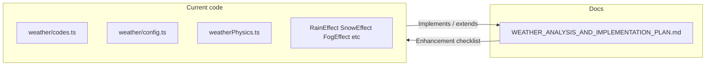

# Weather analysis doc and implementation enhancements

## Goal

- **Save the comprehensive weather analysis** into the project as a single reference in [docs/](docs/).
- **Compare current implementation to that analysis** and list concrete enhancements so the simulation matches the described behaviour (without over-engineering).

---

## 1. New document in docs/

**File:** [docs/WEATHER_ANALYSIS_AND_IMPLEMENTATION_PLAN.md](docs/WEATHER_ANALYSIS_AND_IMPLEMENTATION_PLAN.md) (to be created)

**Contents (structure):**

1. **High-level idea** — Perceptual cues, not strict physics; API → effect type, intensity, wind, temperature/humidity, cloud cover, time of day.
2. **Sections 1–10 from the provided analysis** — Rain, Drizzle, Snow, Sleet/Freezing rain/Wintry mix, Thunderstorms, Fog & Mist, Haze/Smog/Dust, Clouds, Wind (cross-cutting), API → simulation mapping. Use the full text you provided (no programmer jargon; keep “simulation cues” and “real-world behavior” as in the prompt).
3. **Current implementation summary** — Short subsection that maps the repo to the analysis:

- **Effect types:** [src/weather/types.ts](src/weather/types.ts) defines `EffectType`: clear | rain | snow | fog | thunderstorm. Drizzle is mapped to `rain` in [src/weather/codes.ts](src/weather/codes.ts) (codes 51–57); sleet/haze/dust are not separate types.
- **Physics constants:** [src/weather-simulation/physics/weatherPhysics.ts](src/weather-simulation/physics/weatherPhysics.ts): `RAIN_FALL_SPEED_BASE` (0.38) > `SNOW_FALL_SPEED_BASE` (0.075); `RAIN_WIND_FACTOR` (0.018) > `SNOW_WIND_FACTOR` (0.0025); `CLOUD_WIND_FACTOR` (0.0008) and `MIST_WIND_FACTOR` (0.00032). Gust variance and thunderstorm multipliers present.
- **Rain:** [RainEffect.tsx](src/weather-scene/effects/RainEffect.tsx) uses one fall speed and one wind factor; no separate “drizzle” mode (slower fall, higher wind factor, smaller/softer particles).
- **Snow:** [SnowEffect.tsx](src/weather-scene/effects/SnowEffect.tsx) has per-flake sway (phase, SNOW_SWAY_AMPLITUDE/OMEGA), lower wind factor, lower fall speed — aligned with analysis.
- **Fog / Mist:** [FogEffect.tsx](src/weather-scene/effects/FogEffect.tsx) uses `FogExp2` and `config.fogDensity` (humidity-scaled in [config.ts](src/weather/config.ts)); single fog color. [MistEffect.tsx](src/weather-scene/effects/MistEffect.tsx) uses planes and `fogDensity` for opacity; wind drift minimal — aligned except fog color is not time-of-day dependent.
- **Clouds:** [CloudEffect.tsx](src/weather-scene/effects/CloudEffect.tsx) uses `CLOUD_WIND_FACTOR` and `cloudCover` for opacity; no dawn/dusk tint.
- **Thunderstorm:** Dark sky (STORM_SKY_COLOR), lightning flash in [WeatherScene.tsx](src/components/weather-scene/WeatherScene.tsx), thunderstorm wind/rain multipliers in physics — aligned.
- **Frost:** Frost overlay when `temperature < 0` (public/effects/frost.png, 50% opacity).

1. **Enhancement checklist** — Actionable list derived from the analysis and the summary above (see Section 2 below). This stays in the same doc so the plan and the analysis live together.

No duplication of [docs/WEATHER_SIMULATION_ENGINE_PLAN.md](docs/WEATHER_SIMULATION_ENGINE_PLAN.md); that file remains the older R3F/architecture plan. The new doc is the single place for “how each weather should look/move” and “how we implement or will enhance it.”

---

## 2. Enhancement checklist (to be applied in code after the doc exists)

These items should be listed in the new doc and can be implemented in order.

- **Drizzle vs rain:**
  - In [src/weather/codes.ts](src/weather/codes.ts) add a small helper e.g. `isDrizzleCode(code: number): boolean` (true for 51–57).
  - In [src/weather/config.ts](src/weather/config.ts) (or in a shared type) expose a flag on the config used by the scene, e.g. `isDrizzle: boolean`, derived from weather code when `effectType === "rain"`.
  - In [src/weather-simulation/physics/weatherPhysics.ts](src/weather-simulation/physics/weatherPhysics.ts) add `DRIZZLE_FALL_SPEED_BASE` (lower than rain) and `DRIZZLE_WIND_FACTOR` (higher than rain).
  - In [RainEffect.tsx](src/weather-scene/effects/RainEffect.tsx) when `config.isDrizzle` (or equivalent): use drizzle fall speed and wind factor; optionally reduce particle size and soften opacity so it looks like a “misty veil” rather than heavy streaks.
- **Fog color by time of day:**
  - In [FogEffect.tsx](src/weather-scene/effects/FogEffect.tsx) set fog color from `config.timeOfDay` (e.g. lighter gray/blue for day, darker blue/gray for night), using a small map or constant per phase, instead of a single `FOG_COLOR`.
- **Sleet / wintry mix (optional):**
  - If desired later: when temperature is near 0°C and effect is rain or snow, blend particle counts or add a mix (e.g. some rain + some snow particles) or a dedicated sleet look (faster, smaller, brighter). Not required for the first pass; document as “optional” in the doc.
- **Clouds dawn/dusk tint (optional):**
  - In [CloudEffect.tsx](src/weather-scene/effects/CloudEffect.tsx) optionally tint cloud material color or opacity by `config.timeOfDay` (e.g. orange/pink at dawn/dusk). Document as optional.
- **Deprecated constants:**
  - In [weatherPhysics.ts](src/weather-simulation/physics/weatherPhysics.ts) the per-intensity `RAIN_FALL_SPEED` and `SNOW_FALL_SPEED` are deprecated and unused. Remove their re-export from [src/weather-scene/physics/constants.ts](src/weather-scene/physics/constants.ts) and, if nothing else references them, remove the objects from weatherPhysics.ts to avoid dead code.
- **Haze / smog / dust:**
  - Leave as “not implemented” in the doc; the analysis describes them as fog-like with different colors. No code change unless you later add a dedicated effect type and API mapping.

---

## 3. Flow

1. Create [docs/WEATHER_ANALYSIS_AND_IMPLEMENTATION_PLAN.md](docs/WEATHER_ANALYSIS_AND_IMPLEMENTATION_PLAN.md) with the full analysis (sections 1–10), the “Current implementation summary,” and the “Enhancement checklist” as above.
2. Implement the checklist items in the order given (drizzle first, then fog color, then optional sleet/clouds, then deprecated cleanup). Haze/smog/dust remain documented but unimplemented unless you decide to add them later.

---

## 4. Summary

- **One new file:** [docs/WEATHER_ANALYSIS_AND_IMPLEMENTATION_PLAN.md](docs/WEATHER_ANALYSIS_AND_IMPLEMENTATION_PLAN.md) containing the full weather analysis (plain, comprehensive), a short “current implementation vs analysis” summary, and a concrete enhancement list.
- **No change** to [docs/WEATHER_SIMULATION_ENGINE_PLAN.md](docs/WEATHER_SIMULATION_ENGINE_PLAN.md).
- **Enhancements** are scoped to: drizzle handling, fog color by time of day, optional sleet and cloud tint, and removal of deprecated physics exports. No new effect types or API surface beyond a small `isDrizzle`-style flag if needed for the scene config.
